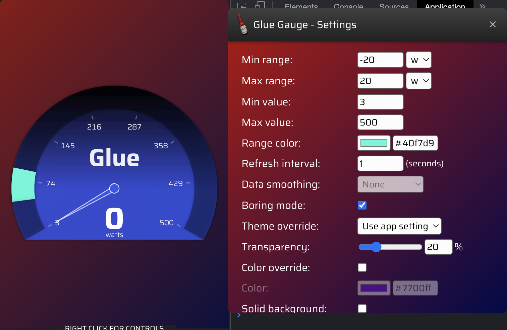

Glue gauge
========

It adds a gauge where you see the average wattage of the peleton and your owns.
So you can focus on not blasting too much watts to stay in the group.



Installation
--------
A Sauce for Zwift "Mod" is a directory placed in `~/Documents/SauceMods`.  NOTE: "Documents"
may be called "My Documents" on some platforms.  For first time mod users they should create
an empty **SauceMods** folder first.  Then each Mod will be a sub directory in there such as...
```
Documents
└── SauceMods
    ├── glue_gauge